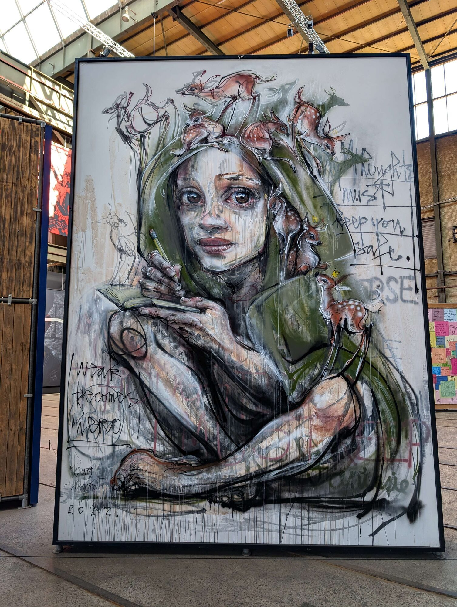
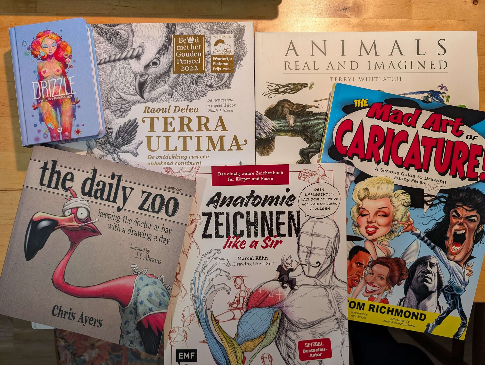

# Welcome to Waldflaufer’s World!

Researcher · Maker · Mentor · Musician

Good to have you here.

I do not let go of things. I had the papers for a violin-making apprenticeship
and never sent them, and built a tenor ukulele years later instead. I loved the
ice as a child and took up figure skating at 30. Whatever I pick up tends to
come back.

At work, I teach machines to see: stereo cameras that measure in three
dimensions, accurate enough for a person to work next to a robot and trust it.
I defended my PhD on that at TU Ilmenau in August 2026, after starting out in
biomedical engineering.

I am just as happy at a wood lathe. What I work out along the way lands here,
rather than in scattered notebooks. A treasure chest I keep filling. A few
things from it:


Built with a professional luthier looking over my shoulder.
A doctoral hat with a tendon-driven robotic hand, five servos and a calibration target. I built it for a colleague. Later, they built mine.
Printing with clay, where I ended up calibrating the material like a measurement.
A competition needs a dress. I own a sewing machine, so: why not.


 

## How I learn

Technical books, open-source projects, a lot of video, a lot of trying it myself, and talking to
people who already know more. That applies to a stereo camera and to a wood
lathe in about equal measure. The wood lathe just forgives less.

## What drives me

What actually gets me to start varies. Sometimes I want to be able to do it
myself. Sometimes the result is simply beautiful. Sometimes two ideas just
want to be combined. Sometimes the process itself is what I need. I do not
wait for one particular reason.

Passing it on matters just as much - at UNIKAT, the makerspace at TU Ilmenau I
have been part of since 2017, through CyberMentor, and by supervising theses
along the way.

People I meet, music I hear and art I see feed this too: street art at the
Straat Museum, kayaking in the Spreewald, a conversation that turns into a
project months later.

 

And the name? It started as a typo. The
[whole story](/about/#why-waldflaufer) is on the about page.

Now that you know the person, here is where each part of this actually lives:



How precise does a measurement have to be before someone can rely on it?
That question became my PhD at TU Ilmenau: stereo cameras that calibrate
themselves so a robot can work next to a person, on FPGA, Jetson Nano and
Raspberry Pi. Publications on ORCID.


Wet apple wood, which you are not supposed to use - the workshop smelled of
apples for days. Printed clay, embroidery, resin, and whatever comes next.


21 supervised theses, the UNIKAT makerspace, CyberMentor, and workshops I
wrote so nobody has to start from zero.



## Get in touch

If any of this overlaps with what you are working on, I would like to hear from
you. The links are in the sidebar.
