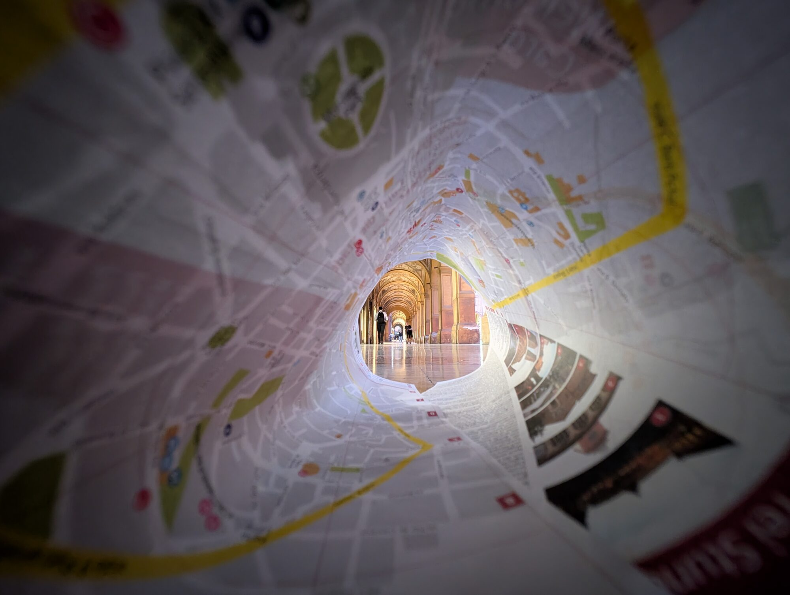

# Welcome to Waldflaufer’s Creative Playground!

Step into my world, where creativity knows no boundaries! Whether I'm crafting handcrafted ukulele, experimenting with new engineering projects, or expressing myself through art and music, this space is where all my passions come together. Explore and get inspired for my next creative adventure!

<!-- Step into my world of creative projects, inspiration, and experiments! Here, you'll find everything—from handcrafted ukuleles to embroidery and drawings. Let yourself be inspired and discover what might spark my next creative adventure. -->

## Explore My Creative World

From woodworking and embroidery to science experiments and sports challenges, here you’ll find a little bit of everything.  
This is a place where creativity, engineering, and artistry collide.

    

Alongside my artistic projects, I also dive into technical experiments, like my ongoing work with **stereo vision and robotics** (ZED on Ice), FPGA-based imaging systems, and autonomous robot calibration.  

Whether crafting, coding, or building, I aim to explore, learn, and share each new idea along the way.

## Ancora Imparo – Join Me on a Journey of Innovation and Creativity

Always in search of new ideas, techniques, and projects, I combine my love for making, engineering, science, and music to create something unique. Join me as I explore new ways to craft, build, design, and play.

 

## Sources of Inspiration

I find inspiration everywhere – in the people I meet, the music I hear, the art I see, and the ideas I discover.  
Whether exploring street art at the Straat Museum, kayaking in the Spreewald, meeting musicians and artists in New York, or stumbling upon a book or video that sparks new ideas, each experience fuels my creative and technical projects.

    

## Who Am I?

If you'd like to get to know the person behind the projects, take a look here and discover more [About](/about/).

## Explore More

<a href="/research/" class="button">Research</a>
<a href="/playground/" class="button-portfolio">Playground</a>
<a href="/inspiration/" class="button-learning">Inspiration</a>
