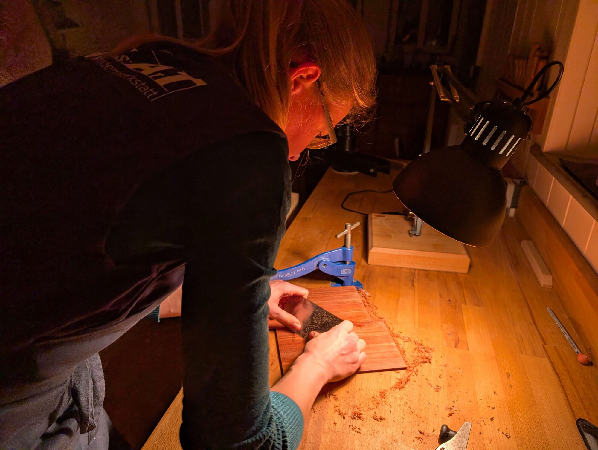
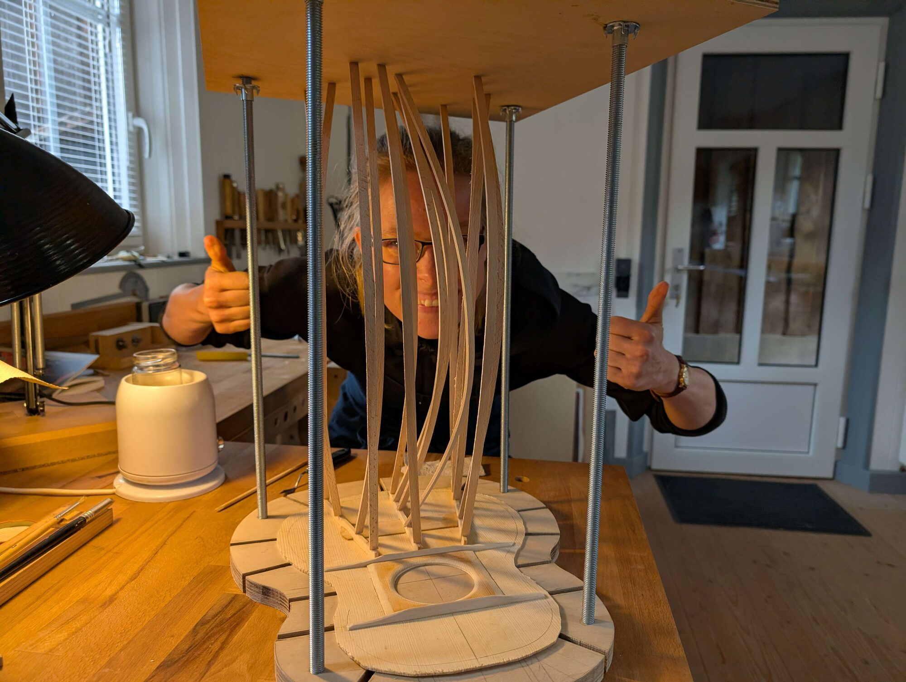
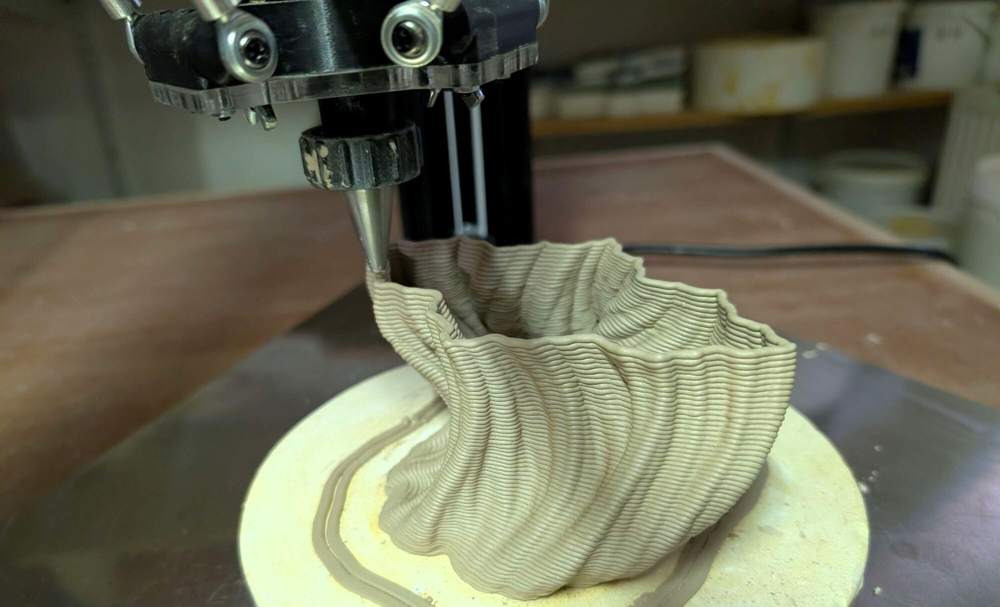
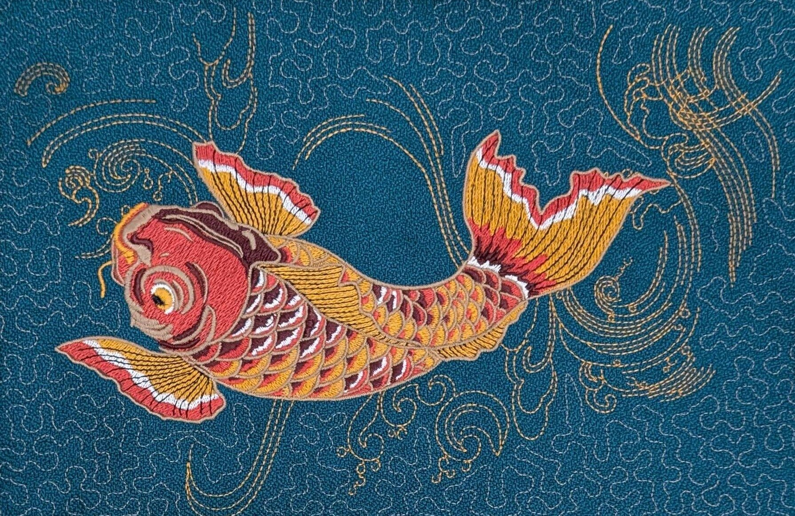
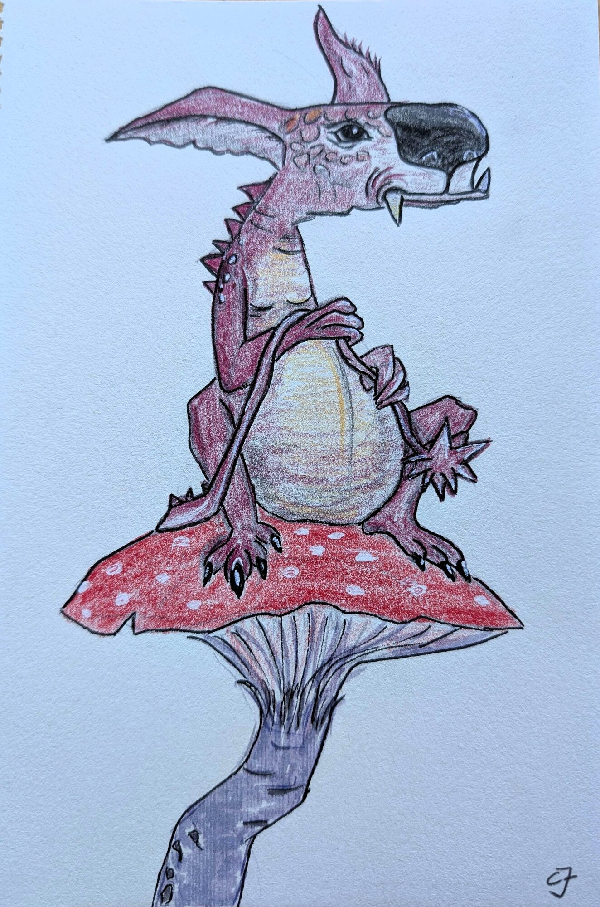
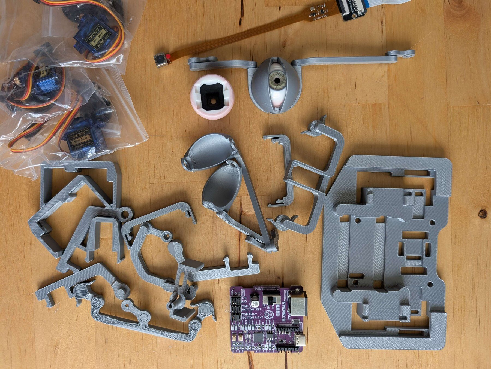

# Welcome to Waldflaufer’s World!

Researcher · Maker · Mentor · Musician

Good to have you here. I think in pictures, and the fastest way for me to
understand something is to build it.

At work, that turned into teaching machines to see: stereo cameras that
measure in three dimensions, accurate enough for a person to work next to a
robot and trust it. I defended my PhD on that at TU Ilmenau in August 2026,
after starting out in biomedical engineering. I love that work, and I am just
as happy at a wood lathe.

Because here is the thing: I do not let go of things. I had the papers for a
violin-making apprenticeship and never sent them, and built a tenor ukulele
years later instead. I loved the ice as a child and took up figure skating at
30. Whatever I pick up tends to come back.

And what I work out along the way lands here, rather than in scattered
notebooks. A treasure chest I keep filling.



How precise does a measurement have to be before someone can rely on it?
That question became my PhD at TU Ilmenau: stereo cameras that calibrate
themselves so a robot can work next to a person, on FPGA, Jetson Nano and
Raspberry Pi. Publications on ORCID.


The violin-making apprenticeship I never applied for, finished years late as a
tenor ukulele. And everything I have built since: printed clay, embroidery,
resin, wet apple wood that made the whole workshop smell of apples.


21 supervised theses, the UNIKAT makerspace, CyberMentor, and workshops I
wrote so nobody has to start from zero.



And the name? It started as a typo. The
[whole story](/about/#why-waldflaufer) is on the about page.

## How I learn

Technical books, a lot of video, a lot of trying it myself, and talking to
people who already know more. That applies to a stereo camera and to a wood
lathe in about equal measure. The wood lathe just forgives less.

 

## Where the ideas come from

People I meet, music I hear, art I see. Street art at the Straat Museum,
kayaking in the Spreewald, a conversation that turns into a project months
later.

   

## Get in touch

If any of this overlaps with what you are working on, I would like to hear from
you. The links are in the sidebar.
