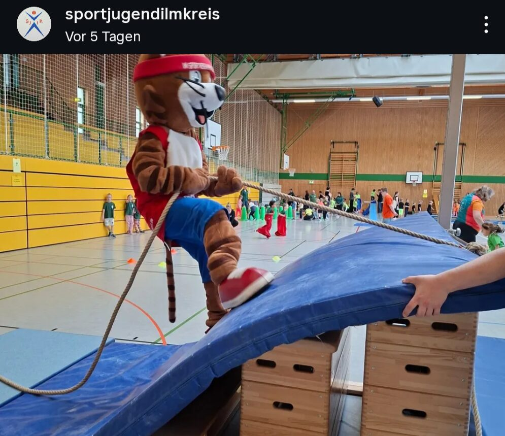

Hi, I’m Christina Junger. Good to see you here.

When something catches my interest, I start. Then I work out how to do it
properly: technical books, a lot of video, a lot of trying it myself, and
talking to people who are already doing it. That applies to a stereo camera and
to a wood lathe in about equal measure.

I go by **Waldflaufer** online. The name started as a typo, and the story is
further down this page.

## Why am I starting my blog now?

I have always kept myself busy. Now that the dissertation is finished, I finally
have time to write down what I make and what I learn along the way.

### Long-running threads

 

**Music.** Violin since 1997, viola since 2007, and I still play in orchestras.
Piano from 2008 to 2011, made possible by the Fritz und Lieselotte Hopf
Foundation (SPN Nördlingen).

I started elsewhere, but the [Rieser Musikschule](https://riesermusikschule.de/)
is where I spent the longest: lessons, music theory, and several orchestras.
And greetings to the Chaos Orchester of Christian Möwes. I get invited every
year, and whenever I can make the time, I play.

**Water.** I swam competitively when I was younger. Open water is where I feel
freest, and I like water enough that it eventually put me in a kayak too.

**Movement.** Taekwondo on and off since around 2001, and I keep coming back to it
for the elegance and the footwork. I took up figure skating at 30 with
[EC Ilmenau](https://eci-eiskunstlauf.de/website/). And for a few years now
contemporary dance, which turns out to help the skating more than I expected.

  

**Also:** board games, and a camera that comes along most places.

### Professional Background

* Bachelor's and Master's degrees in Biomedical Engineering, TU Ilmenau, Germany
* Research Fellow, TU Ilmenau, 2017–2025
* PhD in Industrial Image Processing, TU Ilmenau, defended 14 August 2026
* Key Projects: FPGA stereo vision, autonomous robot calibration, transparent object detection with AI

More on all of that, including awards and training, on the [Career](/career/) page.

<figure>
  
  <figcaption>Me at the SPIE conference (Maryland, 2024)</figcaption>
</figure>

### Volunteer Work

* Youth officer (*Jugendwart*) at my figure skating club, EC Ilmenau
* [CyberMentor](https://www.cybermentor.de/), mentoring for schoolgirls in STEM
* [UNIKAT](https://unikat-ilmenau.de/wiki/), the makerspace at TU Ilmenau: active member, organisation, own workshops and introductory courses

## Why "Waldflaufer"?

The name is a typo. I was setting up a character in _Path of Exile_, an elf archer, and wanted the ranger class, which is called "Waldläufer" in German: someone who runs through the woods. I was in a hurry and typed "Waldflaufer" instead.

A friend saw it and asked what a Waldflaufer was. Nobody knew, and the name stuck. Greetings to Peggy, Martin, Vinzenz and Julian, my gaming group at the time.

It fits better than the correct word would have. I do run through the forest now and then, mostly to clear my head, and I like the smell of wood more than most people. A typo that turned out to be accurate.