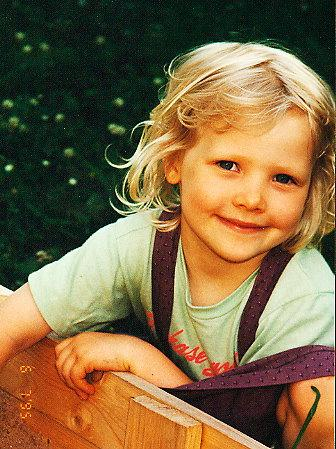
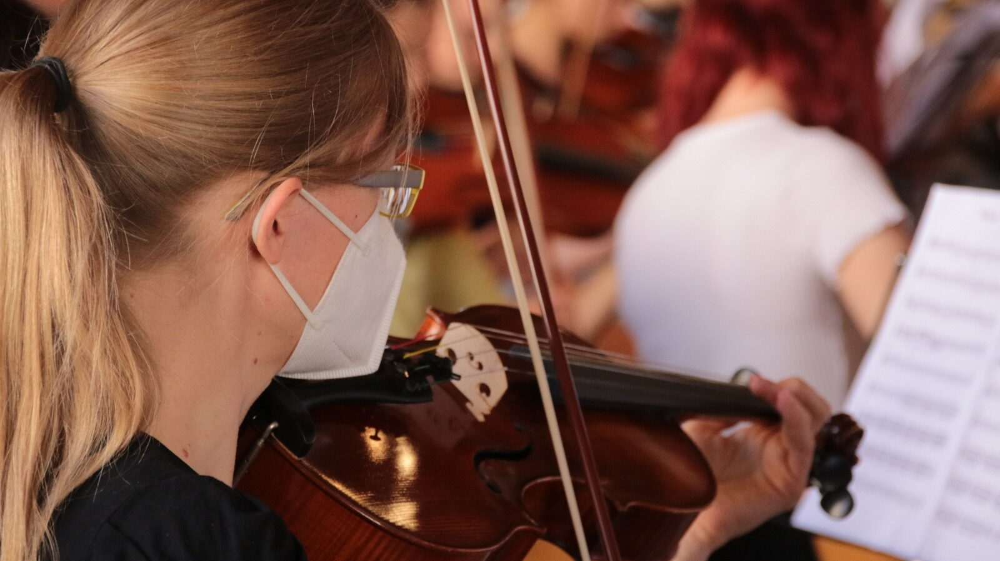
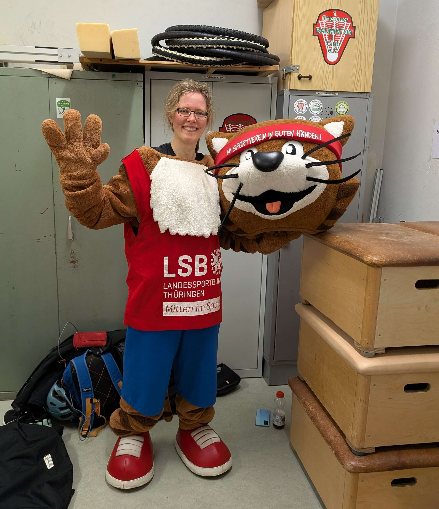
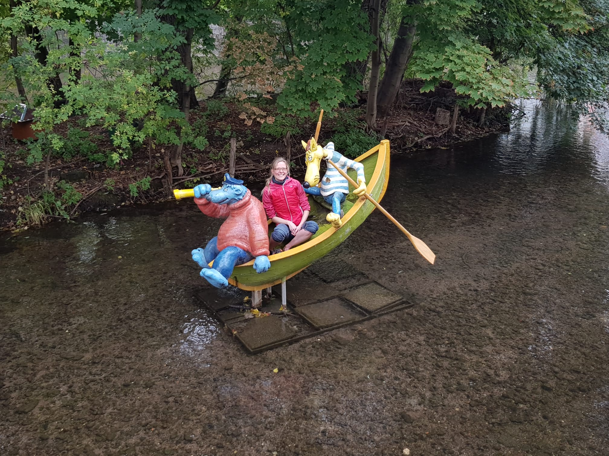

Hi, I'm Christina Junger — good to see you here.

When something catches my interest, I start. Then I work out how to do it
properly: technical books, a lot of video, a lot of trying it myself, and
talking to people who are already doing it. That applies to a stereo camera and
to a wood lathe in about equal measure.

I go by **Waldflaufer** online. The name started as a typo, and the story is
further down this page.

## Why am I starting my blog now?

I have always kept myself busy. Now that the dissertation is finished, I finally
have time to write down what I make and what I learn along the way.

### Long-running threads

 

**Music.** Violin since 1997, viola since 2007 — I still play in orchestras.
Piano from 2008 to 2011, made possible by the Fritz und Lieselotte Hopf
Foundation (SPN Nördlingen).

I started elsewhere, but the [Rieser Musikschule](https://riesermusikschule.de/)
is where I spent the longest: lessons, music theory, and several orchestras.
And greetings to the Chaos Orchester of Christian Möwes — I get invited every
year, and whenever I can make the time, I play.

**Water.** I swam competitively when I was younger. Open water is where I feel
freest, and I like water enough that it eventually put me in a kayak too.

**Movement.** Taekwondo on and off since around 2001 — I keep coming back to it
for the elegance and the footwork. I took up figure skating at 30 with
[EC Ilmenau](https://eci-eiskunstlauf.de/website/). And for a few years now
contemporary dance, which turns out to help the skating more than I expected.

  

**Also:** board games, and a camera that comes along most places.

### Professional Background

* Bachelor and Master Degree in Biomedical Engineering, TU Ilmenau, Germany
* Research Assistant, TU Ilmenau, 2017–2025
* PhD in Industrial Image Processing, TU Ilmenau — defended 14 August 2026
* Key Projects: FPGA stereo vision, autonomous robot calibration, transparent object detection with AI

More on all of that, including awards and training, on the [Research](/research/) page.

<figure>
  
  <figcaption>Me at the SPIE conference (Maryland, 2024)</figcaption>
</figure>

### Volunteer Work

* Youth officer (*Jugendwart*) at my figure skating club, EC Ilmenau
* [CyberMentor](https://www.cybermentor.de/) — mentoring for schoolgirls in STEM
* [UNIKAT](https://unikat-ilmenau.de/wiki/), the makerspace at TU Ilmenau — active member, organisation, own workshops and introductory courses

<!--
  NOCH OFFEN:
  - CyberMentor: bitte kurz bestaetigen, dass die Beschreibung stimmt.
  - UNIKAT: du wolltest die Workshops noch genauer beschreiben.
  - Contemporary: du hast mir geschrieben, wie schoen die Truppe ist - lustig,
    freundlich, und der Koerper freut sich. Das war "nur fuer mich" gesagt,
    deshalb steht es nicht auf der Seite. Sag Bescheid, wenn es rein darf -
    es ist genau die Art Satz, die eine Seite menschlich macht.
-->

## Why "Waldflaufer"?

The name „Waldflaufer” came about in a completely unexpected way! While creating my character in _Path of Exile_ (PoE), I was in a rush and wanted to pick the class „Waldläufer” (ranger) for my elf archer, inspired by my love for running through the woods and the fresh scent of wood. But in my haste, I accidentally typed „Waldflaufer” instead.

When my friend saw it, he laughed and said, "What’s a Waldflaufer?" – by the way, special shoutout to Peggy, Martin, and Vinzenz (my gaming group at the time)! And somehow, the name stuck. It perfectly captured my occasional runs through the forest (which help me clear my mind) and my joy in being surrounded by nature and the scent of wood.

**Now, „Waldflaufer” has become more than just a typo; it’s a name that reflects my connection to the outdoors, a bit of adventure, and the unexpected moments that make life interesting.**
