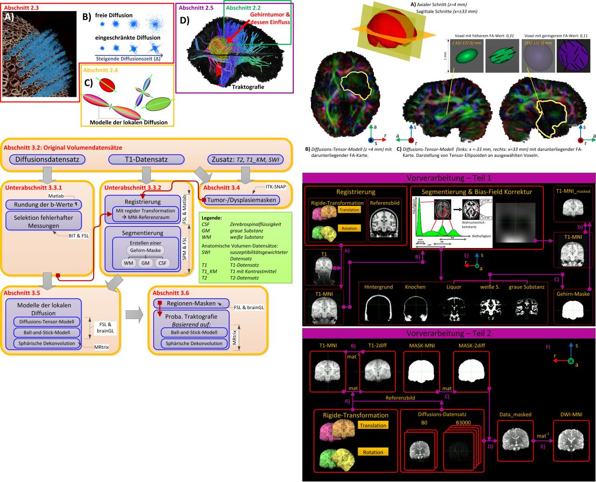
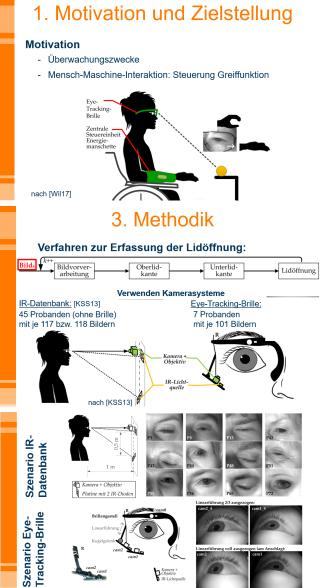
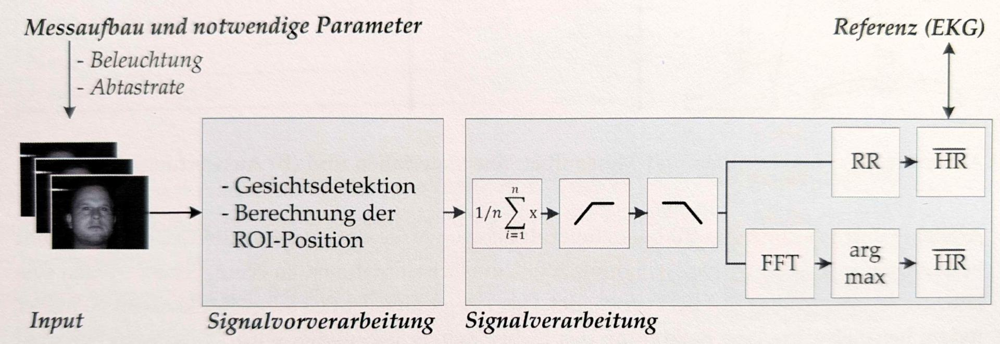

Before the cameras and the robots, I studied **Biomedical Engineering** at
TU Ilmenau, Germany - Bachelor from 2011 to 2015, Master from 2015 to 2017,
both at the Institute of Biomedical Engineering and Informatics.

BSc and MSc, Biomedical Engineering, TU Ilmenau, Germany

## How I got from medicine to measurement

Looking back, the path is a straight line. It did not feel like one at the
time.

**School work placement**, Agentur Becker, Heidenheim, Germany, graphics and
design department - I had always liked pictures, graphics, anything visual,
so this is where it started, years before any of the measurement work below.

**Term paper, 2014**, TU Ilmenau, Germany - treatment of severe heart failure
using electrical and mechanical cardiac support systems.

**Group research project, 2015-2016**, TU Ilmenau, Germany, Institute of
Biosignal Processing - optimisation of an energy harvesting system for
stochastic, non-continuous energy packets, alongside developing a heart rate
detection system.

**Bachelor's thesis, 2015**, Max Planck Institute for Human Cognitive and
Brain Sciences (MPI CBS), Leipzig, Germany - applying tractography methods to
data from tumour patients, after a research internship there pre-processing
the underlying diffusion data sets.

**Master's thesis, 2016-2017**, Fraunhofer Institute for Digital Media
Technology (IDMT), Ilmenau, Germany - a dynamic eye model for determining
eyelid opening in eye-tracking systems.

**Seminar project, 2016-2017**, Fraunhofer IDMT, Ilmenau, Germany -
photoplethysmography from video recordings: measuring pulse from a camera
alone, alongside the thesis above.

Cardiac support, energy harvesting, tractography, eyelid tracking, pulse from
video - five different pieces of work, and every one of them came down to the
same question: how do you measure something reliably, on a person or right
next to one, without getting in the way. Camera-based measurement and
calibration were not a change of direction. They were what these projects had
been asking about the whole time.
