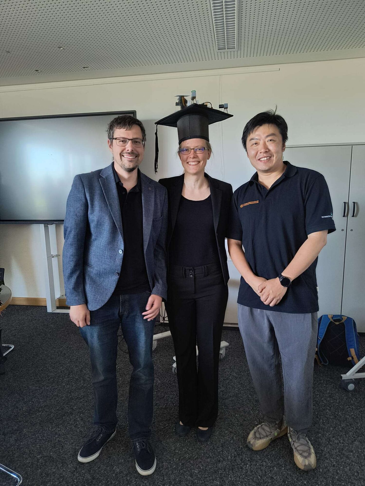
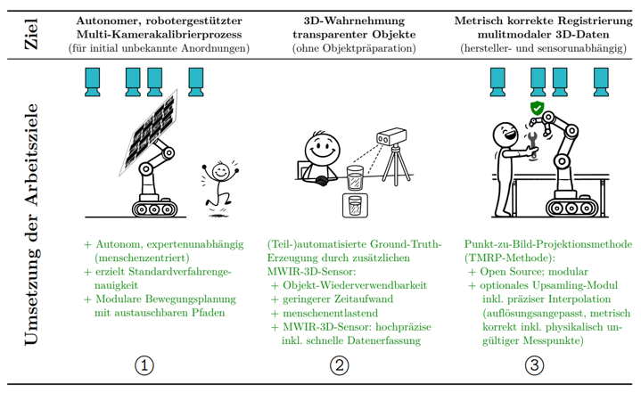
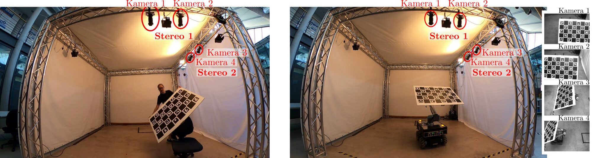
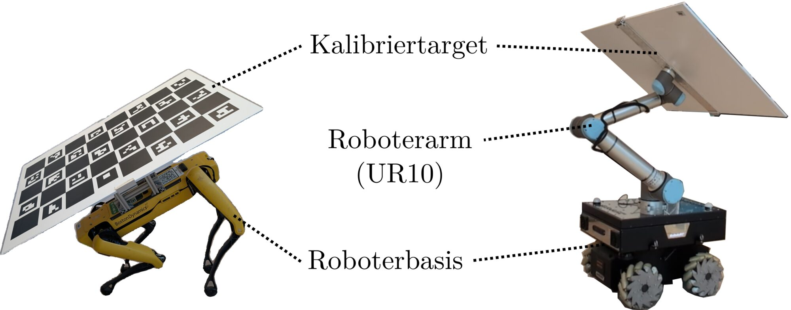

In August 2026 I defended my PhD at TU Ilmenau:

*Stereo Vision Systems with Autonomous Calibration and High Data Quality for
Integration into Human–Robot Collaboration Systems.*

PhD in Industrial Image Processing, TU Ilmenau, Germany · defended 14 August 2026

## How I was employed along the way

**Research Fellow**, Group for Quality Assurance and Industrial Image
Processing, TU Ilmenau, Germany

2017–2025

**Research Fellow**, TU Ilmenau Transfer GmbH, Ilmenau, Germany - a short,
fixed-term position afterwards (common in German academia under the
WissZeitVG), developing application-oriented concepts for an industrial
subcontract: translating research into something a company could use
directly.

September–December 2025

## The three goals

Three project lines run through the whole thesis: **autonomous robot-assisted
multi-camera calibration**, **3D perception of transparent objects**, and
**metrically correct registration of multimodal 3D data**. The transparent
objects are harder than they sound, because such an object mostly shows you
what is behind it.

<!--
  phd.png ist deutsch beschriftet und mit 719x441 px etwas klein fuer
  Bildschirme mit hoher Aufloesung (Retina). Sobald eine englische Fassung aus
  der SVG-Quelle da ist, mit mindestens 1400 px Breite exportieren und
  komprimieren (docs/medien-komprimieren.md), dann phd.png ersetzen.
-->

## Recurring topics


stereo vision, camera calibration, sensor fusion, 3D reconstruction,
multimodal 3D data, robotics, human–robot collaboration,
industrial image processing


Hardware along the way: FPGA, Jetson Nano, Raspberry Pi and the
Arduino MKR Vidor 4000.

Publications are listed on **[ORCID](https://orcid.org/0000-0002-5310-495X)**.

<!--
  NOCH ZU ERGAENZEN: einzelne Forschungsprojekte als eigene Beitraege,
  Konferenzreisen.
-->
