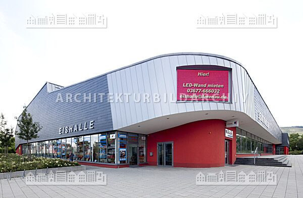

<!-- header_image: "/images/ice-rink-header.jpg" -->

**Project in progress – initial experiments with skeleton estimation. Coming soon!**

# ZED 2i Meets Figure Ice Skating: Real-World Camera Test

I got in touch with the ZED 2i and was immediately impressed by this stereo camera, as well as by the promotional videos from StereoLabs. I shared my idea with my colleague Pavol Kurina: to record myself on the ice, test the skeleton tracking, and overlay the captured skeletons onto an avatar (for example, an Elephant URDF). Since I had experience with multi-stereo camera systems, I thought, why not use multiple cameras? But I wanted to start small first, to see if the idea actually worked.

My colleague was excited and wanted to join in. He thought it was a fantastic project.

<video width="640" controls>
  <source src="placeholder.mp4" type="placeholder/mp4">
  Dein Browser unterstützt dieses Video nicht.
</video>

## Quick Introduction of My Colleague Pavol

I first met Pavol during my time as a student at Fraunhofer IDMT in Ilmenau (May 2016 – Nov. 2017), where he was also employed. 
I quickly got to know his family when I helped him with a move. 
Years later (starting in August 2020), he moved to the [Group for Quality Assurance and Industrial Image Processing](https://www.tu-ilmenau.de/en/university/departments/department-of-mechanical-engineering/profile/institutes-and-groups/group-for-quality-assurance-and-industrial-image-processing) at the Technische Universität of Ilmenau, where I was also working by then.

Here are a few brief bullet points about Pavol:

1. a family man and Freelance Software Engineer
2. ...

<figure>
  
  <figcaption>Pavol Kurina (meet him on <a href="https://www.linkedin.com/in/pavol-kurina-43834210/?originalSubdomain=de/">LinkedIn</a>).</figcaption>
</figure>

## Our Experiment (Preliminary Study)

### Location

Ilmenau Ice Rink: Since I am a member of the [EC Ilmenau Figure Skating Club](https://eci-eiskunstlauf.de/website/), I had the opportunity to use the ice during training hours around midday. This gave us enough space for a reality check of the ZED 2i camera(s).

<figure>
  
  <figcaption>Eishalle Ilmenau (Bildquelle!!!).</figcaption>
</figure>