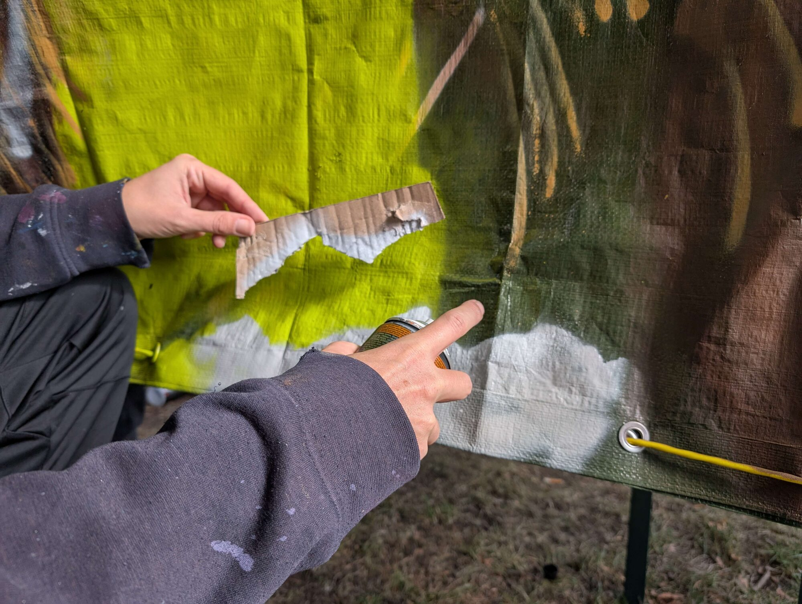
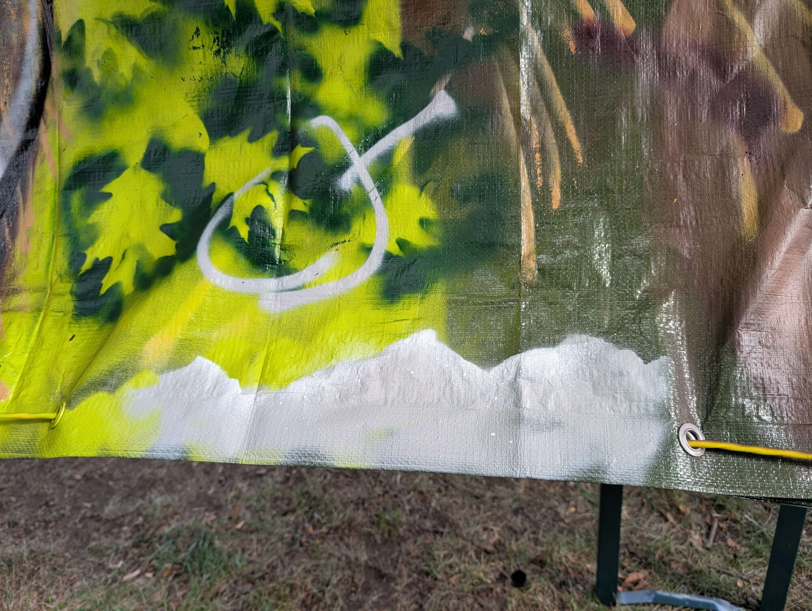
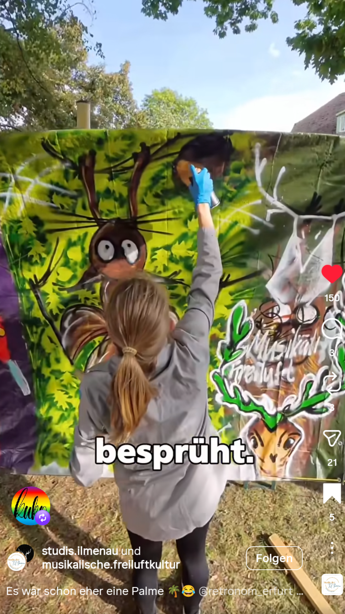
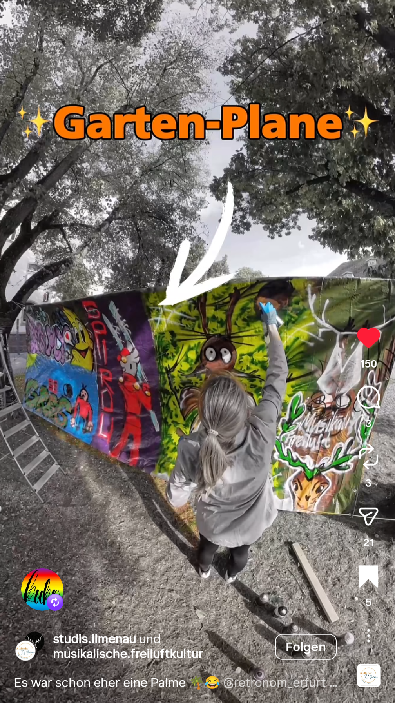

## Trying something new

I had never really tried graffiti before, so when I got the chance to join a graffiti workshop, I simply wanted to see what it was like.

What I particularly enjoyed was the combination of creativity, technique, and just getting started without knowing exactly what the result would look like.

  <blockquote class="instagram-media" data-instgrm-permalink="https://www.instagram.com/reel/DO-c0tRDNtJ/?igsh=cDJyejB3Z2E0Zmtz" data-instgrm-version="13">
    <a href="https://www.instagram.com/reel/DO-c0tRDNtJ/?igsh=cDJyejB3Z2E0Zmtz" target="_blank">Instagram Post</a>
  </blockquote>

 

 

## Thanks

A huge thank you to [AG MFK](https://mfk-kollektiv.de/) (Musikalische Freiluftkultur, Ilmenau) for organizing the workshop and giving us the opportunity to try something completely new.

And a big thanks to [Marco Quade](https://malschule-weimar.de/wir/dozenten/marco-quade/) from Erfurt for sharing his skills, experience, and passion for graffiti with us.

It was a lot of fun — and definitely something I would like to try again.
