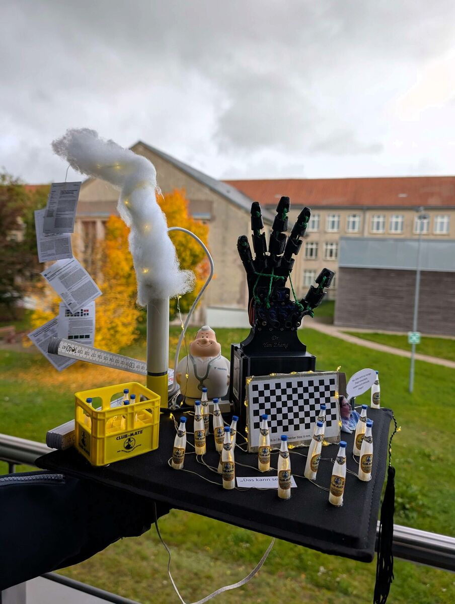

Big congratulations to my colleague Dr. Yan Zhang!  

**Materials:**

- [Flexible robotic hand](https://www.thingiverse.com/thing:1980129), printed in TPU
- 5× servo motors: SG92R
- Microcontroller board (for controlling the servos)
- Screws (for assembly)
- String / cord (for finger movement)

## Thanks

And thanks to my colleague Martin for building the hat with me.
Thanks to Benjamin, who printed the hand in TPU for us.