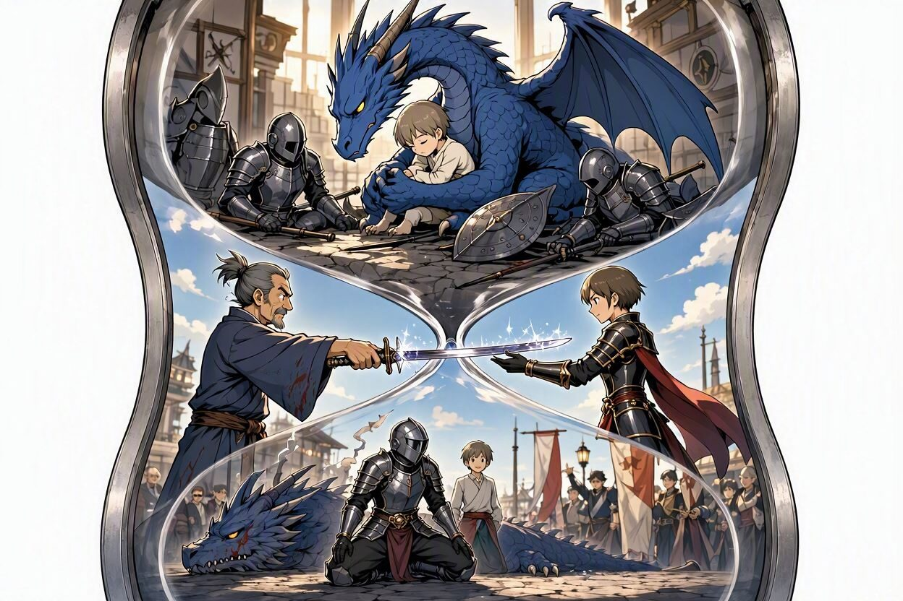

Alongside the research itself, I spent these years learning how to lead it, fund
it, communicate it and get it out of the lab. Grouped by what it was actually
for:

## Leading and working with people

**Rowena-Morse-Mentoring Program**, Jena

2023–2024

**Leadership in Science**, Graduate Center, TU Ilmenau

2021–2025

**2015, as a student:** two consecutive summer schools at St. Petersburg
Electrotechnical University "LETI", St Petersburg, Russia - the 2nd
International Summer School Symposium Sense.Enable.SPITSE and the Summer
School for Young Researchers, part of a strategic partnership between the
engineering faculties of TU Ilmenau, St. Petersburg Electrotechnical
University, and Moscow Power Engineering Institute.

<!-- HIER: 2-3 Saetze von dir. Nicht "ich habe X gelernt", sondern
     "seitdem mache ich Y anders". -->

## Turning research into something usable

**Engage Program & Masterclass**, Alinea, funded by AMS-OSRAM AG

2025

**Empower Masterclass Series**, Alinea, funded by EIT Culture & Creativity

Completed 2 April 2026 · 25 training hours · Self-Awareness & Self-Efficacy, Motivation & Perseverance, Mobilising Resources, Financial & Economic Literacy, Mobilising Others

> This program was an incredible opportunity to learn about the entrepreneurial
> journey, connect with inspiring women and receive invaluable advice from
> mentors. After the program, I feel fully empowered and ready to move forward
> with turning my research into a real-world impact.

<!-- HIER: 2-3 Saetze von dir. -->

## Getting research funded

**Marie Skłodowska-Curie Actions Postdoctoral Fellowship Training**, Inria, Paris

June 2026 · grant writing and proposal development

At the grant-writing workshop, two things stuck with me from Paolo, my CPPI
(*Chargé de Partenariat et de Projets d'Innovation*) at National Institute for Research in Digital Science and Technology (Inria, France): **tell it
as a story, and structure the introduction like an hourglass - open wide to
catch a reviewer who is often not a specialist and reading your proposal
unpaid and tired, narrow down to the exact problem and solution, then widen
out again to show why it matters.**

He explained it as **find the dragon and kill the dragon**: a prince held
captive by a dragon, and knights who already tried and failed (the problem -
who cares?), an amazing sword from a Japanese master swordsmith arriving
just in time (your solution), and the dragon killed with it, the prince
freed, and everyone happy (so what?). I had two versions of this generated
to see which one explains it better:

Who Cares? (A-D)
Your Solution (E, F)
So What? (G, H)

The A-H model as an hourglass: find the dragon, the solution, kill the dragon - Paolo's story (generated with <a href="https://www.bing.com/images/create/ai-image-generator">Bing Image Creator</a>, MAI-Image-2.5-Flash model).

A: reviewer interest · B: importance · C: state of the art · D: challenges and benefits · E: concept and credibility · F: project's purpose · G: advancing the field · H: world with the problem solved

At this point, a heartfelt thank you for the opportunity, and to Matthieu Py
& Paolo Simonelli, who ran the workshop with a lot of humour and did it
really well. Getting to know the other participants was enriching too.

> **My key takeaways**
> 1. Say clearly what you want, and why you need the funding
> 2. Then write the introduction like an hourglass:
>    - Set the stage - who cares, why it matters, what has already been tried
>    - State the theme - your solution, and why it is credible
>    - Create a vision - what the field looks like once the problem is solved
> 3. Write it as a good story - the reviewer may not be from your field, and
>    is possibly reading it tired, in the evening or on the go
> 4. A strong hook at the start buys goodwill - reviewers already in a good
>    mood tend to forgive more later on
> 5. The cinema effect: plant a detail early on (something on a newspaper or
>    a flipchart in the background, say) and pay it off again at the very
>    end - reviewers who noticed it the first time feel smart when they see
>    it resolved, and that makes them happy
> 6. Show it, do not just state it - do not write "I am interdisciplinary,"
>    always ask yourself: how? and let the reviewer see it for themselves
> 7. Read the EU proposal template closely and follow it exactly - down to
>    every single verb

**Upcoming, 21-25 September 2026:** the 1st SUNRISE PhD & Young Researchers
Academy, a one-week Erasmus+ Blended Intensive Programme at European
University Cyprus, together with TU Ilmenau and the other SUNRISE Alliance
partner universities. Research proposal writing, entrepreneurial pitching,
and a lot of networking.

## Communicating science

Graduate Center TU Ilmenau: scientific writing, poster design, infographics, science communication in podcasts, rhetoric and presentation

<!-- HIER: 2-3 Saetze von dir. -->

---

Instructors, dates and workload for every single course:
**[full record](full-record/)**
