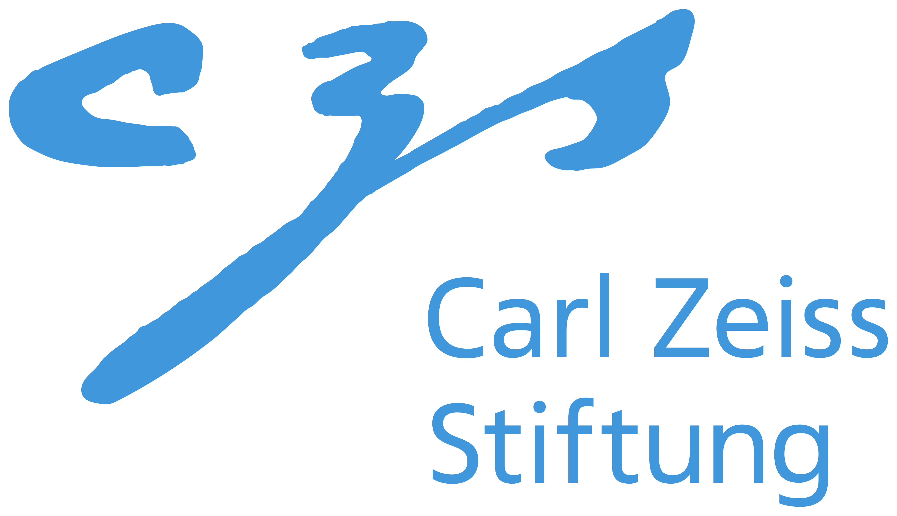
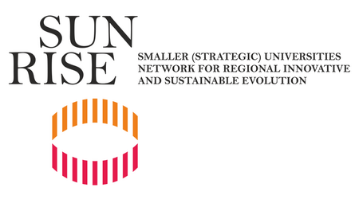
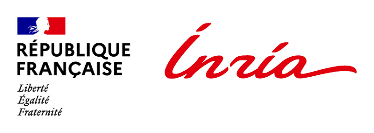
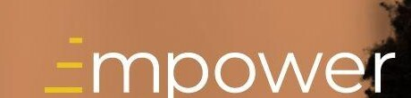
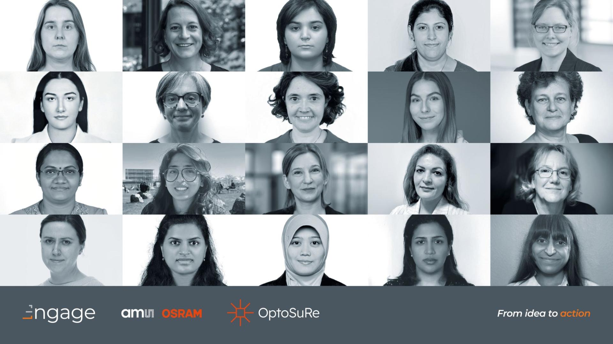
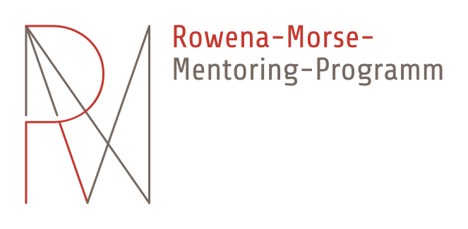
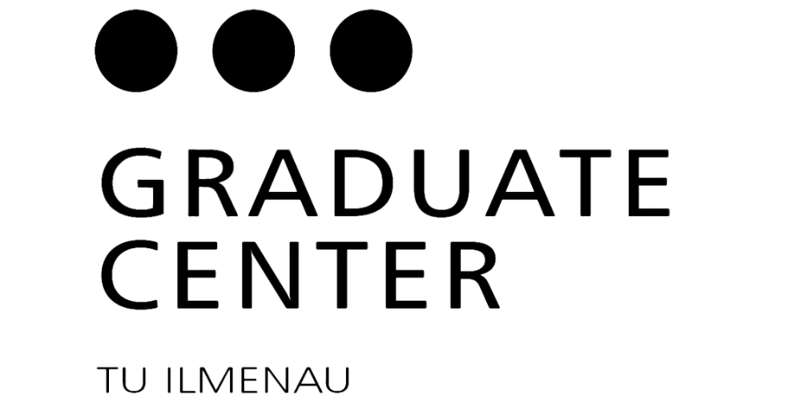
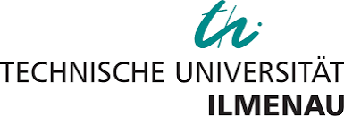

The overview page groups this by theme. This page is the complete record, with
instructors and dates, for anyone who needs the detail.

**WU** = *Workload Units* (German: *Arbeitseinheiten, AE*), the unit used by the
Graduate Center of TU Ilmenau. **Self-selected** marks courses I sought out
myself rather than ones assigned within the programme.

## Programmes and fellowship training

**[CZS STEM Impact School](https://wissenschaft-im-dialog.de/projekte/czs-stem-impact-school/)**, Refugio Berlin, Lenaustraße 3, Berlin, Germany
· 1–2 September 2026, both days starting 10:00 · upcoming · in German · for
researchers interested in the societal impact of their work who want to
learn effective science communication tools · a free place funded by the
Carl-Zeiss-Stiftung as a CZS alumna, travel and accommodation self-funded ·
organised by Wissenschaft im Dialog

> **The Five Modules**
>
> Building toward an individual communication and impact plan, with a focus
> on inter- and transdisciplinary exchange between participants:
>
> 1. **Impact** - the concept of societal impact, and science communication
>    as a path towards it.
> 2. **Outcome** - defining target audiences, and the effects wanted within
>    them.
> 3. **Output** - an overview of science communication formats, choosing
>    one, and getting feedback from peers and speakers.
> 4. **Input** - putting the chosen format into practice: translating the
>    research for the target audience, and quality indicators for good
>    science communication.
> 5. **Quality** - reflecting on the quality of science communication, then
>    presenting and discussing the impact plans, with a look ahead.
>
> [Accompanying open educational resources](https://wissenschaft-im-dialog.de/programme/academy/open-educational-resources/)

**1st SUNRISE PhD & Young Researchers Academy: Advancing Research Careers in Health & Digital Health and Digitalisation & Industry 4.0** (Erasmus+ Blended Intensive Programme), European University Cyprus, Nicosia
· 21–25 September 2026, plus a virtual session on 11 September · upcoming · 3 ECTS · with SUNRISE Alliance partner universities including TU Ilmenau · workshops on research proposal writing, academic writing and pitching entrepreneurial ideas, alongside poster presentations, networking and cultural activities

**Marie Skłodowska-Curie Actions Postdoctoral Fellowship Training**, Inria, Paris, France Matthieu Py & Paolo Simonelli
· 22–26 June 2026 · Grant writing and proposal development

> **Key Takeaways: The A-H Structure**
>
> The workshop's structure for a grant introduction, in full. It works like an
> hourglass: start broad, narrow down to a sharp focus, then broaden out again
> ("find the dragon and kill the dragon" on the [overview page](../) - find the
> dragon is the problem, the solution is the great Japanese sword, and killing
> the dragon is the world made better):
>
> 1. Say clearly what you want, and why you need the funding.
> 2. Set the stage - who cares, why it matters, what has already been tried:
>    - (A) Get the reviewer interested at the outset.
>    - (B) Identify the importance, stress the need.
>    - (C) Summarise the state of the art.
>    - (D) Describe technical challenges to solving the problem, and potential benefits.
> 3. State the theme - your solution, and why it is credible:
>    - (E) Describe the concept and establish credibility.
>    - (F) Describe your project's fundamental purpose.
> 4. Create a vision - what the field looks like once the problem is solved:
>    - (G) Show how your work will advance the field.
>    - (H) Envision the world with the problem solved.

> **Key Takeaways: Practical Checklist**
>
> From the same workshop:
>
> - Use clear, self-explanatory figures and tables - they should work on
>   their own, without needing the surrounding text to explain them.
> - Use accessible language and avoid acronyms - a reviewer outside your
>   field should not have to decode your text.
> - Keep every page self-contained - no cross-references to other pages,
>   all information, including sources, right there for the reader.
> - Make objectives SMART - specific, measurable, achievable, relevant,
>   time-bound.
> - Read the EU proposal template closely and follow it exactly - down to
>   every single verb.

**Empower Masterclass Series**, Alinea, funded by EIT Culture & Creativity, Helen Fullen
· completed Thursday, 2 April 2026 · online · 25 training hours ·
Self-Awareness & Self-Efficacy, Motivation & Perseverance, Mobilising
Resources, Financial & Economic Literacy, Mobilising Others

**Engage Program & Masterclass**, Alinea, funded by AMS-OSRAM AG, Helen Fullen
· January–April 2025 and November–December 2025 · online

**Rowena-Morse-Mentoring Program**, Jena, Germany
· October 2023 – October 2024

**2nd International Summer School Symposium Sense.Enable.SPITSE** and
**Summer School for Young Researchers**, St. Petersburg Electrotechnical
University "LETI", St Petersburg, Russia
· 22–26 June and 29 June – 3 July 2015 · two consecutive weeks, as a participant ·
SPITSE: a strategic partnership between the engineering faculties of
TU Ilmenau, St. Petersburg Electrotechnical University, and Moscow Power
Engineering Institute

<!-- TODO: Thema/Inhalt der beiden Summer Schools noch ergaenzen. -->

## Graduate Center, TU Ilmenau: Leadership in Science (2021–2025)

### Personal development

**Mein Pitch! Überzeugend präsentieren** *(online, 10 WU)*
Cornelia Stöckmann · 25 March 2021 · Oral communication, creativity

**Listen to me! Wissenschaftskommunikation in Podcasts** *(online, 9 WU)*
Marcus Berger · 22 January 2021 · Communication & presentation · *self-selected*

**Hochschulrhetorik - Stimme und Körpersprache in Präsenz- und Online-Veranstaltungen** *(in person, 8 WU)*
Gottfried Hoffmann · 11 May 2022 · Oral communication, presence · *self-selected*

**Rhetoric and Presentation Training** *(in person, 16 WU)*
Christina Stute · 24–25 October 2022 · Oral communication

**Von 0 auf Wow: Charmant – selbstsicher – eingestellt! Dein Coaching für den Traumjob** *(in person, 20 WU)*
Cornelia Stöckmann & Erek Kühn · 19–20 November 2024 · Oral communication

**Storytelling - wirksamer kommunizieren mit Geschichten** *(in person, 3.5 WU)*
Silvia Angel · 13 March 2025 · Presentation & creativity · *self-selected*

**Sicheres, souveränes & verbindliches Auftreten** *(in person, 22 WU)*
Jan Werth · 12–13 November 2025 · Oral communication

**Mutausbruch: Wie mutige Entscheidungen eine erfolgreiche Zukunft ermöglichen** *(online, 6 WU)*
Jiri van den Kommer · 6–7 October 2025 · Self-management

### Research & teaching

**Statistik mit R** *(online, 20 WU)*
Stefan Heyder · 11–12 March 2021 · Subject expertise, systematic working

**Poster-Design: Wissenschaftlich und ästhetisch präsentiert** *(9 WU)*
Marcus Berger · 23 April 2021 · Subject expertise, creativity

**Auf den Punkt gebracht. Infografiken verständlich und ansprechend gestalten** *(online, 18 WU)*
Claudia Zech · 8–9 June 2021 · Written communication

**Profitipps zur wissenschaftlichen Informationsrecherche** *(online, 2 WU)*
Milena Pfafferott · 12 May 2022 · Subject expertise

**Erfolgreiche Förderanträge schreiben** *(online)*
Wilma Simoleit · February 2023

**Effektive Visualisierungen in der wissenschaftlichen Kommunikation** *(online)*
Sandra Hähle · 9–10 December 2024 · Subject expertise

**Mit Sketchnotes Gedanken, Meetings, Projekte oder Lehre strukturieren** *(in person)*
Salea Rackwitz · 13–14 January 2025 · Subject expertise

**Forschungsdaten effizient handhaben - Einführung ins Forschungsdatenmanagement** *(in person, 2 WU)*
Jessica Rex · 13 March 2019 · Research data management, systematic working · *self-selected*

**Scientific writing: Turning the blank page into a manuscript** *(online, 18 WU)*
Dr. Carsten Rohr · 7 & 14 October 2020 · Scientific writing · *self-selected*

**Denken - Forschen - Argumentieren - Kommunizieren** *(in person, 8 WU)*
Dr. Jochen Spielmann · 19 June 2022, Bauhaus-Universität Weimar · Scientific reasoning & argumentation · *self-selected*

### Management

**Efficiency Skills for Scientists: Get the Same Done in Less Time** *(online, 18 WU)*
Dr. Carsten Rohr · 22 & 29 October 2021 · Systematic working

**Teamleitung und (Selbst)Führung für Ingenieur\*innen** *(online, 18 WU)*
Dr. Christoph Sprung · 18–19 November 2021 · Leadership

## Languages

**English Course for advanced participants (B2 level)** *(20 WU)*
Dr. Ievgeniia Chetvertak · weekly, winter term 2022/23, 12 October 2022 – 1 February 2023

**Mitarbeiter Englisch** *(15 WU)*
Dr. Kerstin Steinberg-Rahal · weekly, summer term 2023, 12 April – 12 July 2023
Listening and reading exercises from the TOEIC certification exam

## Further certificates

**First aid course** · 2 March 2024

<!--
  NOCH ZU ERGAENZEN:
  - Lehrauftrag / UNIKAT: aktives Mitglied, Orga, eigene Workshops konzipiert
    und durchgefuehrt, Einfuehrungskurse. Details fuellst du spaeter.
  - Drohnenfuehrerschein bleibt bewusst draussen (nicht oeffentlich).
-->
