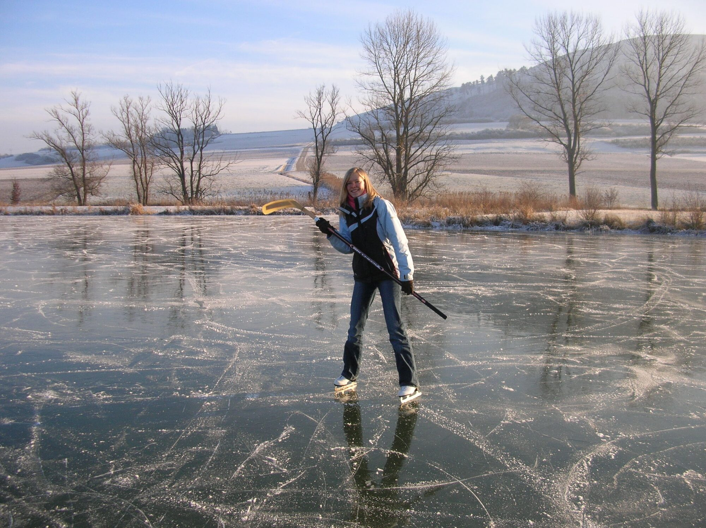
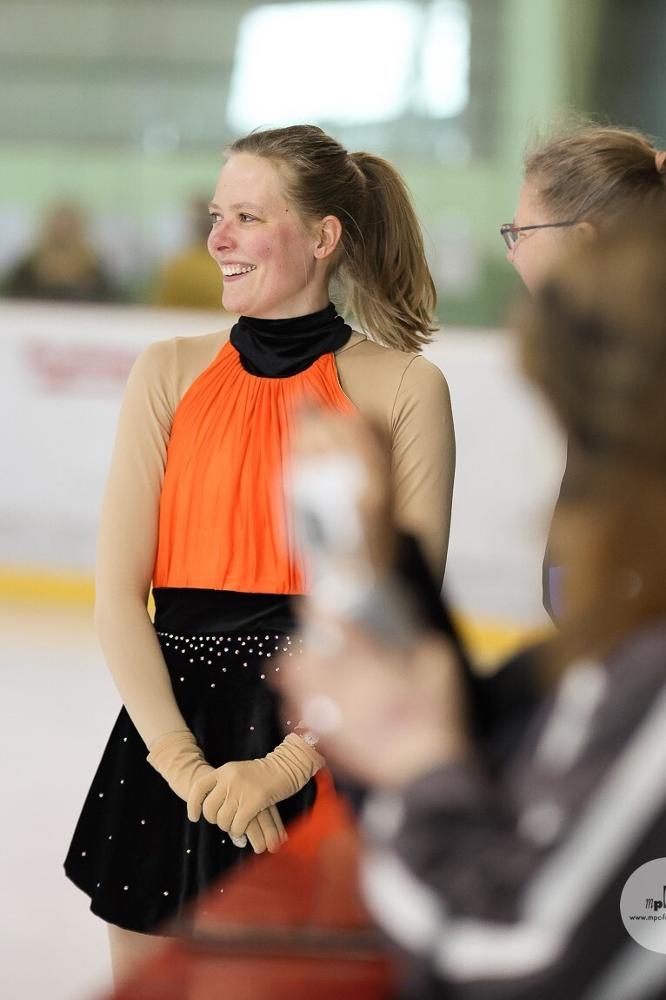
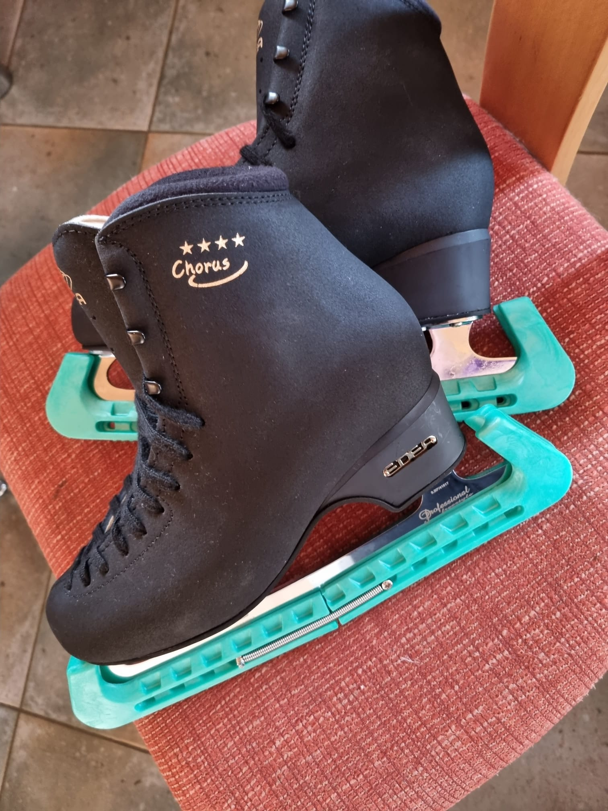

Angefangen hat es auf zugefrorenen Seen. Meine Mutter, meine Schwestern, ein paar Freunde, und wenn die Feuerwehr im Winter eine Bahn geflutet hatte, waren wir da.

Einmal bekam ich von meinen Eltern zehn Trainingsstunden in der Eishalle Aalen geschenkt. Diese Trainingsstunden haben viel Spaß gemacht und danach konnte ich Semmeln, Rückwärtsfahren, ... die Basics. Aalen war leider viel zu weit weg, um
dort regelmäßig hinzufahren. Also blieb es beim Herumfahren auf dem See.

Das änderte sich 2011, als ich zum Studieren nach Ilmenau kam. Plötzlich stand
eine Eishalle vor der Tür, und ich war sonntagabends dort. Anfangs einfach, um
ein paar Runden zu drehen, meistens mit meinem Kumpel Patrick. Liebe Grüße an
dieser Stelle, Patrick!

Irgendwann reichten mir die Runden nicht mehr. Ich wollte wissen, wie ein
Schritt richtig geht und wie ein Sprung funktioniert. Also bin ich in den Verein eingetreten. Ich startete damals mit Vivi und Mary :-D.

_Link: Kürz vor meiner Kür bei den Vereinsmeisterschaft 2026 (Programm 6 D), Ilmenau. Das war mein vierter Wettkampf. Rechts: Meine Schlittschuhe._

Eiskunstlauf ist Ausdauer, Dehnung, Ausdruck, Physik, Rhythmus und Tanz gleichzeitig. Selten verlangt etwas so viele Dinge auf einmal. Ein toller Kontrast zur Arbeit.
Nur bleibt auf dem Eis nicht alles hängen, was einem gesagt wird. Trainer müssen sich oft wiederholen und brauchen sehr viel Geduld... Man bekommt was erklärt, denkt sich: klingt logisch, und dann vergisst man beim Ausführen die Hälfte ^^. Also habe ich angefangen mitzuschreiben: Tipps, Fehler, Laufbilder, Skizzen von der Bahn. Zunächst auf Papier, jetzt hier...

Sich aufnehmen hilft auch sehr gut (da sieht man direkt seine schlechte Haltung oder die nicht ganz gestreckten Beine).

## Woher das Wissen kommt

Vor allem aus meinem eigenen Training beim
[EC Ilmenau](https://eci-eiskunstlauf.de/website/) bei Claudia, Carmen,
Franka und Birgit, und von den anderen Übenden auf dem Eis.

Dazu die tollen Videos von [Kseniya & Oleg](https://www.youtube.com/@kseniyaOleg),
die genau zeigen, wann und wo man im Schuh Druck aufbauen muss.
