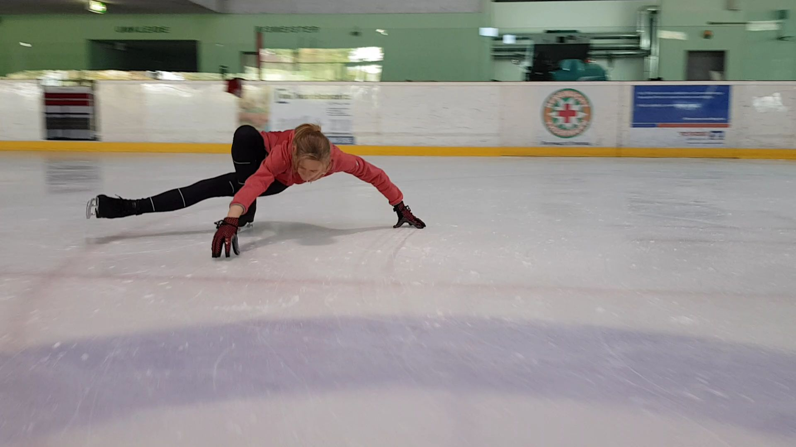

Einer meiner Lieblingselemente :-D

## Trockenübung

## Technik

...

Ganz wichtig: Tiefe Kante, Oberkörper flach über dem Eis, freies Bein gestreckt, Hand am Eis. Man bildet mit seinem Körper ein H.

## Meine Tipps

...

## Fehler

...

## Rhythmus

...

## Laufbild

...

<!--
  Gleiche Gliederung auf jeder Seite - dann findet man sich beim dritten
  Element sofort zurecht. Abschnitte, die bei einem Element nicht passen,
  einfach weglassen.
-->
