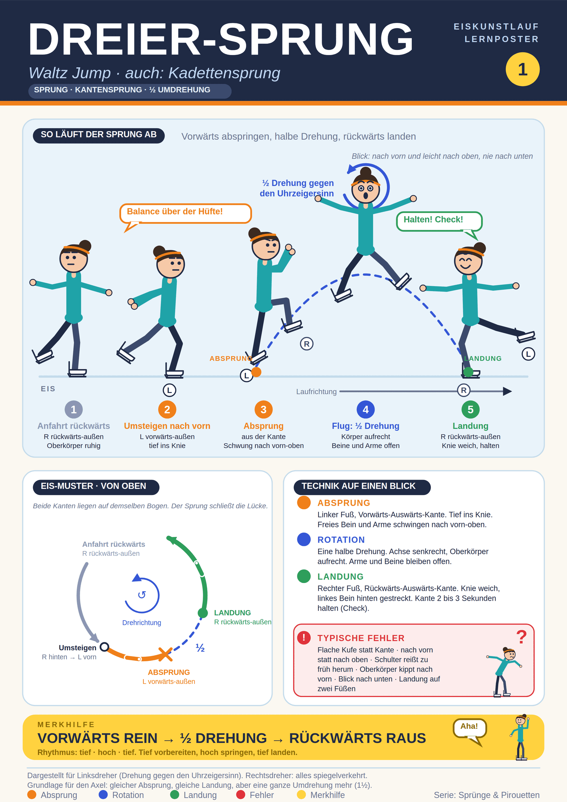

## Was ist es
Einfachster Sprung im Eiskunstlauf, meist der erste, den man lernt. Halbe Umdrehung. Andere Namen: Kadettensprung, englisch Waltz Jump. Kantensprung, kein Zackensprung. Absprung und Landung wie beim Axel (Axel: 1½ Umdrehungen). Vorstufe für Axel, Salchow und Toeloop.

## Alles auf einem Blick

## Abfolge (Linksdreher, Drehung gegen den Uhrzeigersinn)
1. Anfahrt rückwärts, meist auf der rechten Rückwärts-Auswärts-Kante (RBO), Oberkörper ruhig, Arme "gecheckt".
2. Umsteigen nach vorn auf die linke Vorwärts-Auswärts-Kante (LFO). Standbein tief ins Knie, freies Bein hinten gestreckt.
3. Absprung: Standbein streckt sich. Freies rechtes Bein und Arme schwingen von hinten nach vorn-oben. Die Zacke verlässt als Letztes das Eis, der Absprung kommt aus der Kante.
4. Flug: halbe Drehung, Körper aufrecht, Blick nach vorn. Beine offen, Arme nicht eng. Bewegung nach oben, nicht nach vorn.
5. Landung: rechter Fuß, Rückwärts-Auswärts-Kante (RBO). Zacke berührt zuerst, dann Kante. Knie weich. Linkes Bein nach hinten gestreckt, Arme seitlich, Blick vorn-oben. Landekante 2 bis 3 Sekunden halten ("Check").

Merkbild: "tief, hoch, tief".

## Tipps
Balance über der Standhüfte vor dem Sprung. Tiefe, saubere Auswärtskante. Oberkörper aufrecht. Freies Bein kontrolliert durchschwingen. Blick nach vorn, nie nach unten. Landung einbeinig, leise, Knie gebeugt.

## Typische Fehler
Flache Kufe statt Auswärtskante. Nach vorn statt nach oben. Zu früh drehen, Schulter reißt. Freies Bein schwingt zu wenig. Oberkörper klappt nach vorn. Blick nach unten. Landung auf zwei Füßen oder mit gestrecktem Knie. Kein Check.

## Lernweg
Beidbeinige Hüpfer, dann 180° und 360°, dann Dreier an der Bande oder mit Trainer, dann mit Fahrt.

## Hinweis zu einer Abweichung
Die deutsche Wikipedia formuliert den Absprung als "von der Zacke". Alle Trainerquellen beschreiben den Sprung als Kantensprung, bei dem die Zacke nur zuletzt das Eis verlässt. Das Poster folgt den Trainerquellen.

## Quellen
- https://adultsskatetoo.com/pages/waltz-jump-guide-beginners
- https://www.skate-vida.com/blog/waltz-jump-figure-skating
- https://stason.org/TULARC/sports/recreational-figure-skating/6-2-1-Waltz-jump.html
- https://icoachskating.com/waltz-jump-robert-tebby/
- https://icoachskating.com/some-basics-of-jumping-waltz-jump-example-frank-carroll/
- https://icoachskating.com/tom-hickey-waltz-jump-for-young-skaters/
- https://axelflow.com/guides/waltz
- https://gofigureskating.com/skills/jumps/figure-skating-waltz-jump
- https://de.wikipedia.org/wiki/Dreiersprung
- https://de.wikipedia.org/wiki/Spr%C3%BCnge_im_Eiskunstlauf
- https://eiskunstlauf.tsvkoenigsbrunn.de/wissen/elemente
- https://eiskunstlaufblog.de/eiskunstlauf-basics-reihenfolge/