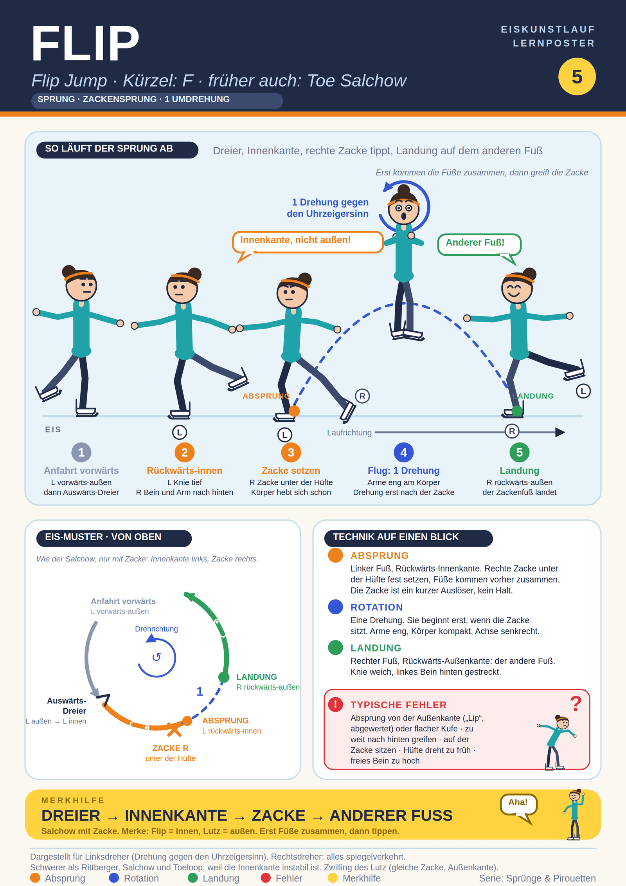

## Was ist es
Zackensprung mit einer Umdrehung. ISU-Definition: Zackensprung, Absprung von der Rückwärts-Innenkante, Landung auf der Rückwärts-Außenkante des anderen Fußes. Kürzel: F. Mechanisch ein Salchow mit Zackenhilfe (früher "Toe Salchow"). Zwilling des Lutz (gleiche Zacke, Außenkante). Schwerer als Rittberger, Salchow und Toeloop, weil die Innenkante instabil ist. Herkunft unklar, möglicherweise Bruce Mapes.

## Alles auf einem Blick

## Abfolge (Linksdreher)
1. Anfahrt vorwärts links, Vorwärts-Außenkante.
2. Auswärts-Dreier links (oder Mohawk), dann rückwärts auf L Rückwärts-Innenkante. Kante klar innen. Linkes Knie tief, rechtes Bein und rechter Arm nach hinten gestreckt (Reach).
3. Zacke: Füße kommen zusammen, bevor die rechte Zacke ins Eis geht. Zacke unter der Hüfte, nicht weit hinter dem Körper. Zackenbein eher gestreckt. Körper hebt sich bereits, wenn die Zacke greift. Zacke ist ein kurzer Auslöser.
4. Flug: eine Drehung, Arme eng, Drehung beginnt erst, wenn die Zacke sitzt.
5. Landung: rechter Fuß, Rückwärts-Außenkante (der Zackenfuß landet).

## Typische Fehler
Absprung von flacher Kufe oder von der Außenkante ("Lip", abgewertet). Zu weit nach hinten greifen. Zacke zu früh oder zu spät. Auf der Zacke sitzen. Hüfte dreht zu früh. Schulter nicht herausgedreht. Freies Bein zu hoch.

## Tipps und Übungen
Merkwort "squash the bug". Zuerst Spagatsprung lernen. Zackenschritt-Übung mit Innenkante und Füße-zusammen. Bei eingeschliffener Außenkante: kurz Außenkante, dann Innenschnitt. Langsam durchgehen, kleine Flips mit Timing, dann volle Kraft.

## Quellen
- https://de.wikipedia.org/wiki/Flip_(Eiskunstlauf)
- https://en.wikipedia.org/wiki/Flip_jump
- https://icoachskating.com/the-flip-jump-part-1-nick-perna/
- https://icoachskating.com/audrey-weisiger-flip-jump-reach-and-pick-placement/
- https://lauralipetsky.com/flip-jump-technique-tips/
- https://gofigureskating.com/skills/jumps/figure-skating-flip-jump
- https://ryabinincamps.com/de/news/figure-skating-flip-jump/