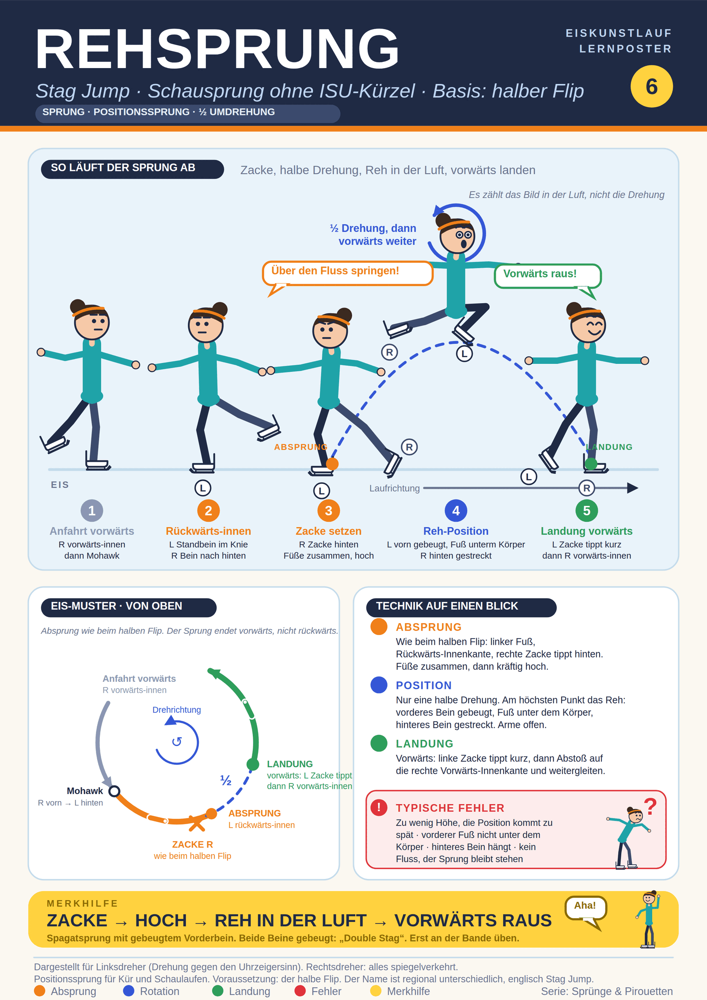

## Einordnung und Unsicherheit
Der Begriff "Rehsprung" ist in deutschen Eiskunstlauf-Quellen kaum dokumentiert. Die deutsche Wikipedia beschreibt ihn allgemein als Sprung von einem Bein auf das andere, bei dem das vordere Bein zunächst gebeugt ist und danach gestreckt wird. Das Poster ordnet ihn dem englischen **Stag Jump** zu. 

## Was ist es
Schausprung ohne ISU-Kürzel, Positionssprung: das Bild in der Luft zählt, nicht die Drehung. Variante des Spagatsprungs: vorderes Bein am Knie gebeugt, Fuß direkt unter dem Körper, hinteres Bein gestreckt. Beide Beine gebeugt: "Double Stag". Lernbar, sobald der halbe Flip sitzt.

## Alles auf einem Blick

## Abfolge (Linksdreher)
1. Anfahrt vorwärts, meist Einwärts-Mohawk auf die linke Rückwärts-Innenkante (auch Dreier möglich).
2. Rechte Zacke hinten setzen, Füße zusammenziehen, hoch (Absprung des halben Flips). Merkbild "über einen Fluss springen".
3. Halbe Drehung; am höchsten Punkt die Reh-Position.
4. Landung vorwärts: linke Zacke tippt kurz, dann Abstoß auf die rechte Vorwärts-Innenkante, weitergleiten.

## Tipps
Position an der Bande und außerhalb des Eises üben. Aus dem Stand beginnen, Tempo langsam steigern. Sprungweite messen. Braucht Beweglichkeit und Sprungkraft.

## Quellen
- https://de.wikipedia.org/wiki/Rehsprung
- https://en.wikipedia.org/wiki/Split_jump
- https://icoachskating.com/split-jumps-basics-and-variations-amy-brolsma/
- https://www.liveabout.com/simple-figure-skating-toe-jumps-1282290
- https://de.wikipedia.org/wiki/Spr%C3%BCnge_im_Eiskunstlauf