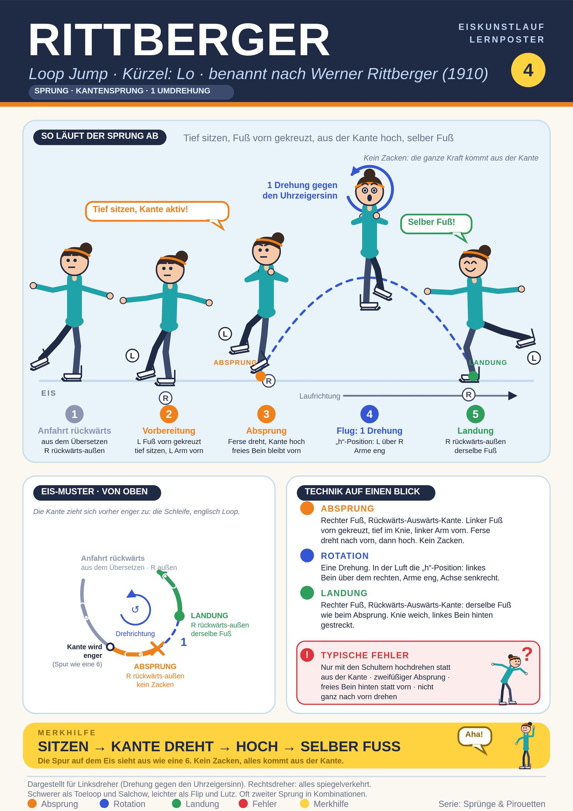

## Was ist es
Kantensprung mit einer Umdrehung. Absprung von der Rückwärts-Auswärts-Kante, Landung auf demselben Fuß und derselben Kante. Kein Zacken. Englisch Loop Jump (nach der Schleife der Spur). Kürzel ISU: Lo. Benannt nach Werner Rittberger, der ihn 1910 erfand. Schwerer als Toeloop und Salchow, leichter als Flip und Lutz. Der US-Verband nennt ihn den grundlegendsten aller Sprünge. Oft zweiter Sprung in Kombinationen.

## Alles auf einem Blick

## Abfolge (Linksdreher)
1. Anfahrt rückwärts, meist direkt aus dem Rückwärts-Übersetzen.
2. Vorbereitung auf R Rückwärts-Auswärts-Kante: linker Fuß vorn über dem rechten gekreuzt, Fußspitze leicht nach innen. Tief im Knie "sitzen". Linker Arm vorn, rechter hinten. Schultern gegen die Kurve gedreht. Kante aktiv, zieht sich enger (Spur wie Fragezeichen oder 6).
3. Absprung aus der Kante: Ferse dreht nach vorn (Pivot), Standbein streckt sich. Freies Bein bleibt vorn. Freier Fuß muss vor dem Standfuß das Eis verlassen (sonst zweifüßig).
4. Flug: eine Drehung, "h"-Position (linkes Bein über dem rechten, Knie gebeugt), Arme eng, Achse senkrecht.
5. Landung: rechter Fuß, Rückwärts-Auswärts-Kante, derselbe Fuß. Linkes Bein hinten gestreckt.

## Typische Fehler
Nur mit den Schultern hochdrehen statt aus der Kante. Zweifüßiger Absprung. Freies Bein hinten statt vorn. Nicht ganz nach vorn pivotieren. Freie Seite nicht über der Standseite.

## Tipps und Übungen
Rückwärts-Auswärts-Dreier mit Armhaltung. Einwärts-Pivot auf links. Rückwärts-Pirouette auf rechts. Übung aus dem Stand mit gekreuzten Füßen ("Herauskicken" der Ferse). Merkwort "Sitzen und Pivot".

## Quellen
- https://de.wikipedia.org/wiki/Rittberger
- https://en.wikipedia.org/wiki/Loop_jump
- https://icoachskating.com/loop-jump-development-part-1-nick-perna/
- https://www.goldenskate.com/forum/threads/advice-on-the-loop-jump.64028/
- https://www.bgsu.edu/content/dam/BGSU/ice-arena/documents/Identifying-Different-Jumps-Aspire.pdf
- https://www.tagesspiegel.de/sport/die-sprunge-beim-eiskunstlauf-wie-man-sie-erkennt-warum-sie-so-heissen-und-wie-schwer-sie-sind-15256856.html
- https://ryabinincamps.com/de/news/loop-jump-technique/