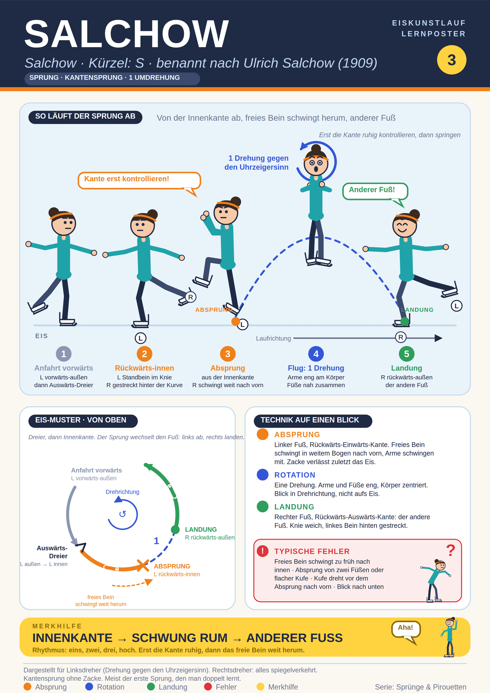

## Was ist es
Kantensprung mit einer Umdrehung. Absprung von der Rückwärts-Einwärts-Kante des einen Fußes, Landung rückwärts-außen auf dem anderen Fuß. Kürzel ISU: S. Benannt nach Ulrich Salchow (Schweden), der ihn 1909 erfand. Meist der erste Sprung, den man doppelt lernt.

## Alles auf einem Blick

## Abfolge (Linksdreher)
1. Anfahrt vorwärts auf links, Vorwärts-Auswärts-Kante (oder Rückwärts-Übersetzen und Umsteigen nach vorn auf links).
2. Auswärts-Dreier links, dann rückwärts auf L Rückwärts-Einwärts-Kante. Freies rechtes Bein gestreckt hinter der Kurve, Arme und Schultern ruhig. Kante erst voll kontrollieren.
3. Absprung: freies Bein schwingt in weitem Bogen nach vorn, Arme schwingen mit und werden eingezogen. Standbein streckt sich, Zacke verlässt zuletzt das Eis. Kontrolliert, nicht hochreißen. Zählrhythmus "eins, zwei, drei, hoch".
4. Flug: eine Drehung (durch den Kantenbogen etwas weniger als 360°). Arme eng, Füße nah zusammen, Blick in Drehrichtung.
5. Landung: rechter Fuß, Rückwärts-Auswärts-Kante. Freies Bein hinten gestreckt, Landung halten.

## Typische Fehler
Freies Bein schwingt zu früh nach innen, bevor der Dreier gecheckt ist. Absprung von zwei Füßen oder flacher Kufe. Kufe dreht vor dem Absprung nach vorn ("geschummelt"). Landung nicht ganz rückwärts. Anfahrt zu schnell oder zu langsam. Blick nach unten.

## Tipps
Kopf ruhig, Blick auf festen Punkt. Schultern und Hüfte zusammen. Füße beim Aufsetzen weit auseinander, sonst wird der Sprung "kratzig". Nur ein bis zwei Hinweise gleichzeitig üben.

## Hinweis zu einer Abweichung
Die deutsche Ryabinin-Seite schreibt, man lande auf demselben Fuß. Das widerspricht allen anderen Quellen. Das Poster zeigt: Absprung links, Landung rechts.

## Quellen
- https://de.wikipedia.org/wiki/Salchow_(Sprung)
- https://en.wikipedia.org/wiki/Salchow_jump
- https://adultsskatetoo.com/blogs/guides/the-salchow-jump-your-first-figure-skating-jump-adult-beginners-guide
- https://icoachskating.com/michelle-leigh-teaching-the-salchow/
- https://iceskatespace.com/master-the-salchow-a-beginner-s-guide-to-timing-and-technique/
- https://ryabinincamps.com/de/news/salchow-jump-in-figure-skating/
- https://eiskunstlauf.de/regeln-und-technik/