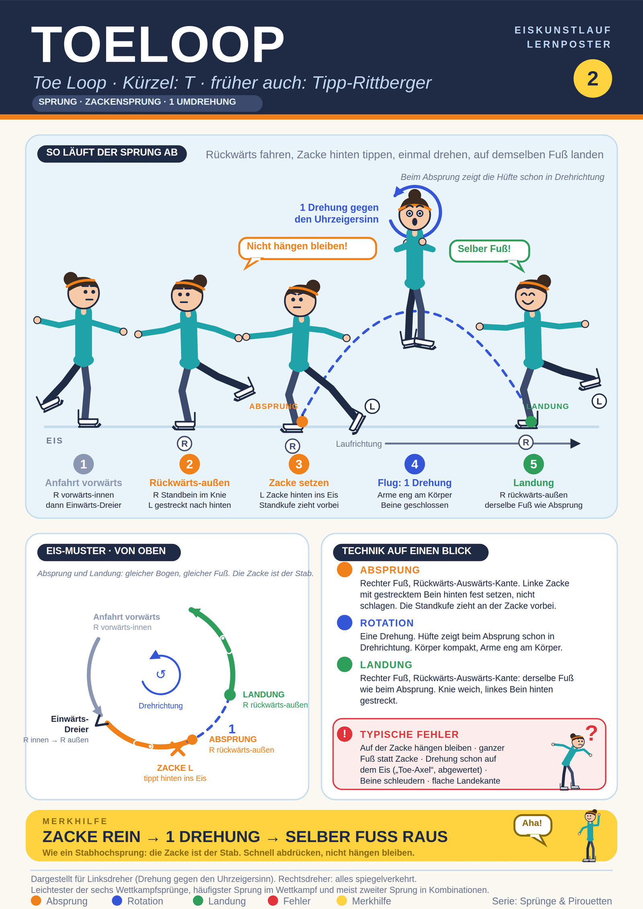

## Was ist es
Leichtester der sechs Wettkampfsprünge, häufigster Sprung im Wettkampf, meist zweiter Sprung in Kombinationen. Kürzel ISU: T. Andere Namen: Toe Loop, früher auch Tipp-Rittberger. Zackensprung: die Zacke des freien Fußes stützt den Absprung. Erfunden in den 1920er Jahren von Bruce Mapes. Gilt als leichtester Sprung, weil die Zacke hilft und die Hüfte beim Absprung schon in Drehrichtung zeigt.

## Alles auf einem Blick

## Abfolge (Linksdreher)
1. Anfahrt vorwärts, rechter Fuß, Vorwärts-Einwärts-Kante.
2. Einwärts-Dreier rechts, danach rückwärts auf R Rückwärts-Auswärts-Kante. Standbein im Knie, linkes Bein gestreckt nach hinten. Alternative: Mohawk und Wechsel auf die Auswärtskante.
3. Linke Zacke setzen: gestrecktes Bein, tief über dem Eis, in Linie hinter der Standkufe, fest setzen, nicht schlagen. Arm der Zackenseite greift nach vorn ("Tür öffnen").
4. Absprung wie Stabhochsprung: Standkufe zieht an der Zacke vorbei, Zacke verlässt zuletzt das Eis. Schnell abdrücken, nicht hängen bleiben.
5. Flug: eine Drehung, Körper kompakt, Arme eng, freies Bein ans Standbein.
6. Landung: rechter Fuß, Rückwärts-Auswärts-Kante, derselbe Fuß und dieselbe Kante wie beim Absprung. Linkes Bein gestreckt nach hinten, Knie weich.

## Typische Fehler
Auf der Zacke hängen bleiben. Mit dem ganzen Fuß statt der Zacke abdrücken. Beine herumschleudern statt scheren. Falsche Armhaltung. Vorrotation auf dem Eis: dreht der Körper vor dem Absprung nach vorn, heißt das "Toe-Axel" und wird abgewertet. Der Toeloop ist der am häufigsten "geschummelte" Sprung. Landung auf flacher Kufe.

## Tipps
Zacke fest setzen und sich daran zurückziehen. Mit den Schultern checken. Übung: Rückwärts-Auswärts-Pivots auf links.

## Quellen
- https://de.wikipedia.org/wiki/Toeloop
- https://en.wikipedia.org/wiki/Toe_loop_jump
- https://ryabinincamps.com/de/news/toe-loop-jump-figure-skating/
- https://ryabinincamps.com/en/news/toe-loop-jump-figure-skating/
- https://www.goldenskate.com/forum/threads/help-toe-loops-and-salchows.54181/
- https://www.bgsu.edu/content/dam/BGSU/ice-arena/documents/Identifying-Different-Jumps-Aspire.pdf
- https://www.britannica.com/sports/Common-Figure-Skating-Jumps-Explained
- https://www.tagesspiegel.de/sport/die-sprunge-beim-eiskunstlauf-wie-man-sie-erkennt-warum-sie-so-heissen-und-wie-schwer-sie-sind-15256856.html
- https://www.wissen.de/lexikon/toeloop